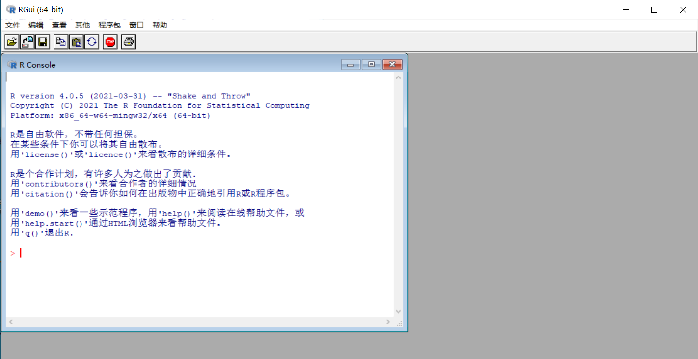
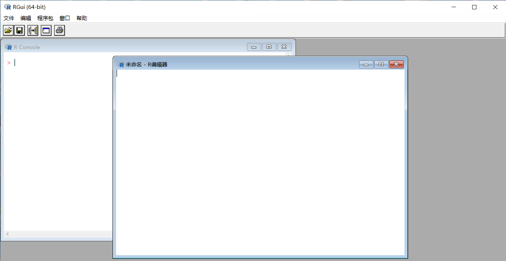
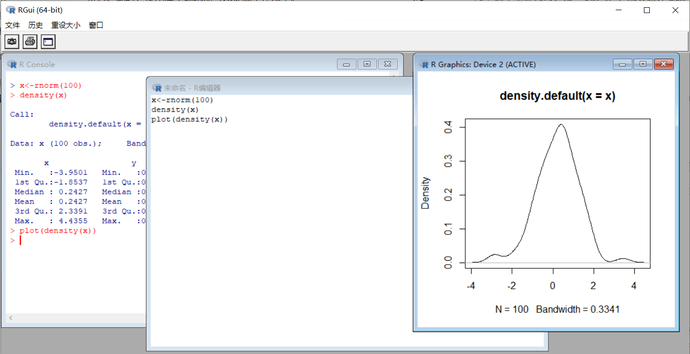
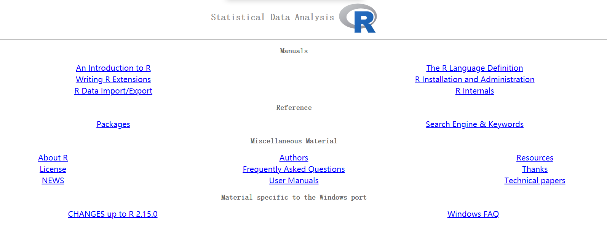
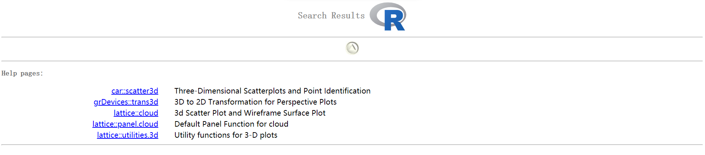

# 1.R语言的背景

R语言是新西兰奥克兰（Auckland）大学的罗伯特·杰特曼（Robert gentleman）与罗斯·伊哈卡（Ross ihaka）基于S语言而联合开发的系统，并由各个领域的专家和志愿人员不断地进行扩展。

R语言之所以大受欢迎，是基于其强大的优势。

1. R语言是免费的，而且是开源的。我们可以自由地下载并免费使用R语言。R语言的开源性特征意味着任何人都可以下载并修改源代码。这为不断优化R语言提供了良好的基础。
2. R语言可以在不同的环境下运行，如Windows、Unix以及Mac OS等。
3. R语言具有强大的扩展性，这使得各种代码和数据得以在短时间内传播和完善。大量的专业人员以扩展包的形式编写用于特定目的的程序，例如用于统计建模、图形绘制等。这使得使用者几乎可以找到任何想要的工具。
4. R语言拥有许多活跃的互动社区，通过在线互动，R语言的知识得到迅速的传播，任何疑难问题都可以找到较好的解决方案。读者可以尝试使用R语言的邮件列表（www.r-project.org/mail.html）

# 2.R语言的基本工作环境

## 2.1.安装R语言

登录网站https://www.r-project.org/后，选择相应的镜像点（CRAN mirror），如我们选择某大学的镜像点，点击后，可以在“Download and Install R”栏目下选择对应系统的R语言下载，如我们选择的是“Download R for Windows"。下载完成后，就可以安装R语言。一般都采用默认设置方式进行安装。安装完成后，即可点击运行R语言。

## 2.2.R语言的基本界面

运行R语言后，会出现类似图1-1的R语言工作界面。



在菜单栏中，通过选择“Edit→ GUI preferences…”可以按照使用者的喜好来改变如字体、窗口等基本设置。

在"Packages"一栏中，可以进行扩展包的安装与载入等操作。在" Windows"一栏中，可以调整窗口的布局。"Help"一栏提供各种各样的使用帮助，建议读者查看"help→Console"来获取一些快捷键的使用方法，例如快捷键"Ctrl+L"可以对控制台进行清屏处理，向上的箭头键和向下的箭头键可以对执行过的历史命令进行选择，以便再一次执行某个命令。

## 2.3.获取和设定工作目录

使用函数getwd()可以获取当前的工作目录（working directory），如果想要设定新的作目录，使用setwd()函数。

下面的例子中，我们首先获取当前的工作目录，然后设置新的工作目录为D盘根目录下R语言文件夹。

注意R语言中分割文件路径的符号的使用方法。通常，我们使用反斜杠（\）来分割文件路径，但是反斜杠在R语言中另有用途，为了避免混淆，R语言中使用正斜杠（/）或者双反斜杠（\ \）来分割文件路径。在本书中，文件路径都以正斜杠来分割，如代码1-1所示。

<!--代码1-1-->

```R
getwd()
[1] "C:/Users/pc/Documents"
setwd("D:/R")
getwd()
[1] "D:/R"
```

## 2.4退出R语言和保存工作结果

读者可以在控制台命令提示符后面输入命令hello R，按回车键后就会得到返回结果，如代码1-2所示

<!--代码1-2-->

```R
"hello R"
[1] "hello R"
```

如果要退出R语言，可以直接关闭R语言窗口，也可以使用命令"q()"。假如我们使用命令"q()"来退出R语言，此时R语言会弹出窗口，提示是否需要保存工作空间（workspace）。如果想要保存，则单击"Yes"。按下确认按钮后，R语言就会关闭，工作空间中的内容就会被保存在工作目录中。如果单击"No"，R语言就会直接关闭，不保存任何信息。

# 3.使用R语言的良好习惯

第一，使用恰当的赋值符号。

通常使用赋值操作符或者赋值运算符"<-"，箭头指向的是被赋值的对象。尽管“=”也可以进行赋值，但不建议使用。根据使用习惯，"->"也可以进行赋值，显示的操作是相同的，如代码1-3所示。

<!--代码1-3-->

```R
x<-"value"
"value"->x
```

另外，assign()函数也可以进行赋值，只是略微有点麻烦，如代码1-4所示：

<!--代码1-4-->

```R
assign("x","value")
```

第二，使用”#“添加必要的注释。

在井字符号（hashtag character）"#"之后添加注释文字，这些文字会被R语言的编译器忽略。添加注释可以提醒使用者代码的含义，尤其是经过很长一段时间后，使用者往往会忘记原来是如何构思程序的。在下面的例子中，"#"之后添加了中文注释，但是x的返回值中却不包括这些注释。

<!--代码1-5-->

```R
x<-c("John1","John2") #1表示英语课，2表示数学课
x
[1] "John1" "John2"
```

第三，请注意在R语言中区分大小写，X和x可以是两个完全不同的变量。

第四，使用键盘中的向上或向下箭头来重复过去执行过的某行命令。输入R语言中的命令都会自动保存，如果想要重复之前的一行命令，或者修改之前的一行命令，可以使用向上或向下箭头来选取。这无疑提高了工作效率。

第五，使用"Esc"键来终止或退出命令。

使用R语言的好习惯并不局限于以上五点，还包括下面几点。由于它们十分重要，因此我们将其单列出来。

# 4.脚本编辑器

在使用R语言的过程中，我们应当充分利用脚本编辑器。在R语言中，经常会反复地用到一些命令，或者需要键入的代码比较长，或者你想存放你认为比较有用处而且易于执行的命令。除此之外，当在R语言中输入较多命令后，当前工作空间会变得杂乱无章，想要找到有用的命令费时费力。此时，使用脚本编辑器可以提高工作效率。

在主菜单上选择"File"标签，并单击"New script"标签就可以打开一个新的脚本编辑器，如图1-2所示。



在脚本编辑器中，我们可以放入一些代码。如果需要执行部分或全部代码，可以这样操作：

1. 将光标停留在需要执行的某一行代码上，按"Ctrl+R"即可以在控制台中执行
2. 选中需要执行的若干段代码，按"Ctrl+R"即可以在控制台中执行
3. 选中全部代码，按"Ctrl+R"，或者选择Edit→Run all就可以执行全部命令

在图1-3中，我们在脚本编辑器中放置了几行代码，将其全部选中后执行，就会在控制台中执行这些代码。当然这些代码是没有错误的，如果有错误，就会出现报错信息，这时就需要回头来检査一下代码中可能隐藏的错误。这里代码的执行结果是在图形窗口中绘制一幅图形。



# 5.从帮助文档中获取信息

在使用R语言的过程中，有哪些方法帮助我们最有效地查找到帮助信息，从而完成相应的工作？常用的帮助函数包括

1. 函数help.start()
2. 函数help()
3. 函数help.search()
4. 函数help(package="...")
5. 函数RSiteSearch()
6. 函数apropos()

此外，经常到网站http://www.r-project.org上去查看和搜索一些有用信息也是非常有助于学习R语言的。

学习从各种帮助文档中快速地获取信息，是使用R语言必须具备的技能。同时，由于R语言中的相关帮助文档数以千计，因此，准确地利用帮助命令可以提高使用R语言的效率。

建议在第一次打开R语言时，就运行命令（见代码1-6）

<!--代码1-6-->

```R
help.start()
```

该命令会打开浏览器的窗口，显示帮助文档的首页，你会找到许多你急切想要了解的信息。我们建议读者首先阅读其中的"An Introduction to R"（R语言简介）

下面我们具体介绍几种常用的寻求帮助的方法

（1）使用help.start()函数

help.start()函数打开的是安装在本地的帮助文档列表，如图1-4所示。



在这张列表中，手册（Manuals）和参考资料（Reference）两个部分较为常用。例如，"An Introduction to R"对于初学者而言是一份非常重要的资料。

在参考资料部分，软件包（Packages）列出了安装在本地的各种软件包，进一步单击软件包名称后，你将获取软件包中函数、测试数据集等信息。如依次单击"Packages"和"graphics"，即可获取R语言中的图形包信息。

在搜索引擎和关键词（Search Engine & Keywords）中，可以通过关键词来查找所有帮助文档，如键入"plot"，就会出现与绘图相关的代码、函数等信息。

（2）使用help()函数、args()函数和example()函数

如果知道某个函数的名称，并想了解函数更多的信息，可以根据个人习惯，使用help()函数，如代码1-7所示：

```R
help(plot)
```

或等价地使用命令，如代码1-8所示：

```R
?plot
```

与help()函数配合地使用args()函数和example()函数，能起到快速学习的功效。args()函数显示相关函数的调用简介，example()函数则给出操作实例。尽管在help(plot)所显示的文档结尾有可供参考的实例，但是对于命令（见代码1-9）

```R
example(plot)
```

则会把绘图函数plot()的典型结果以视觉化的方式进行演示，便于使用者理解和模仿。

（3）使用help.search()函数

在R语言中，可供选择的软件包有很多，但是，在未载入或未确切地知道某一软件包的情况下，该软件包中特定的函数就可能无法通过help()函数搜索到。例如，我们想查看是否有实现3d绘图功能的函数，使用如下命令（见代码1-10）

<!--代码1-10-->

```R
help("3d")
No documentation for ‘3d’ in specified packages and libraries:
you could try ‘??3d’
```

结果显示，R语言无法获取3d的相关信息。但是你肯定的是，R语言不可能不提供3d绘图的功能。因此，根据报错信息的提示，你可以尝试使用命令??3d进行搜索，在函数名称前加"??"符号等价于执行help.search()函数。读者不妨试试使用命令??3d（见代码1-11）

```R
??3d
Error: unexpected symbol in "??3d"
```

不过，结果仍未能如愿。但是，不能因此而放弃，这里为什么会出错呢？不妨试试??"3d"。结果正如你所愿，正如图1-5中所显示的，我们可以在car包中找到绘制3d散点图的函数scatter3d。这里需要注意的是，我们应该将3d作为字符来进行查询，因而需要加上双引号，否则就会得到如代码1-11所示的报错信息。



在了解上面的信息后，使用以下命令就可以直接找到3d散点图的帮助文档（注意，需要首先安装car包），如代码1-12所示。

<!--代码1-12-->

```R
help("scatter3d",package="car")
```

（4）使用help(package="...")函数

事实上，上面的代码告诉我们如何查阅特定包的帮助信息。在安装car包后，下面的命令可以显示关于car包的各种详细的帮助文件（见代码1-13）。

<!--代码1-13-->

```R
help(package="car")
```

（5）使用RSiteSearch()函数进行在线搜索

如果本地帮助文档满足不了用户的需求，我们可以尝试进行在线搜索。RSiteSearch()函数可以使用关键词来搜索在线的帮助文档和邮件列表存档。例如（见代码1-14）

<!--代码1-14-->

```R
RSiteSearch("3d")
A search query has been submitted to http://search.r-project.org
The results page should open in your browser shortly
```

使用代码1-14就会打开浏览器页面，显示搜索结果。读者可在页面上寻找相关的内容，或者进一步添其他关键词进行搜索。

（6）使用apropos()函数进行在线搜索

apropos()函数可以实现以局部匹配的方式来进行关键词搜索，即返回名称中含有某个关键词的所有对象（注意，返回结果随着所安装包的不同而不同）。例如，以下两个命令返回了以"help"和"search"为关键词的搜索结果，返回结果满足局部匹配的特征。

<!--代码1-15-->

```R
apropos("help")
[1] "help" "help.request" "help.search"  "help.start"
apropos("search")
[1] "help.search"         "hsearch_db"          "hsearch_db_concepts"
[4] "hsearch_db_keywords" "RSiteSearch"         "search"             
[7] "searchpaths" 
```

使用命令help(apropos)可以查看apropos()函数的更多信息，从而实现更加精确的搜索。

```R
apropos(what,where=FALSE,ignore.case=TRUE,mode="any")
```

其中，what代表所搜索的对象名称，mode表示对象的模式（mode），例如mode="function"，即存储模式为function的对象。其他两个参数可以暂时忽略。

# 6.基础包和拓展包

使用R语言的一个好处是，众多开发者设计了大量模块化的程序来完成各种不同的工作目标，使用者可以在这些程序中进行选择。我们把这些模块化的程序称作为"包"。每一个包就像是一个锦囊，每一个锦囊中，都有各种厉害的妙计来帮助我们"出奇制胜"。数量众多的程式包可以通过网站https://cran.r-project.org/web/packages/进行下载，也可以通过本书中展示的方法来下载并安装使用。

由于R语言提供的程序包数量非常多，为了有效地管理各类程序包，R语言为那些下载并存储在计算机中的包建立了本地目录，称为"库"（library）。这个名字非常形象，因为"库"对于R语言的作用，正如我们在图书馆里存放和管理书籍一样。使用命令.libPaths()，可以显示“库”的所在位置。

<!--代码1-16-->

```R
.libPaths()
[1] "C:/Users/pc/Documents/R/win-library/4.0"
[2] "C:/Program Files/R/R-4.0.5/library"
```

随R语言一起安装的、用于执行各种统计或绘图等基本功能的程式包，称为基础包或者标准包（base or standard packages），这里面包含了很多R语言的基本函数，是R语言的源代码的重要组成本分。例如，一个基础包是base，要了解这个包中的函数，应使用命令library(help="base")，执行命令后，在返回窗口中能够查看到一份完整的函数列表。读者不妨执行其中的一个命令Sys.time()，看看结果是什么。graphics也是一个非常有用的基础包，请读者用相似的方法查看该包中的函数列表。表1-1列出了随R语言一起安装的主要基础包及其相应的功能。

| 基础包    | 功能                                |
| --------- | ----------------------------------- |
| base      | 提供各类基础函数                    |
| datasets  | 提供各种示例数据集（测试数据集）    |
| graphics  | 提供各种基础绘图函数                |
| grDevices | 提供基础或grid图形设备              |
| methods   | 用于R对象和编程工具的方法和类的定义 |
| stats     | 提供常用统计函数                    |
| utils     | 提供R语言工具函数                   |

如果要查看已经在本地安装的所有包的列表，可以使用如代码1-17所示的命令，注意命令最前面的点号。

<!--代码1-17-->

```R
.packages(all.available=TRUE)
```

