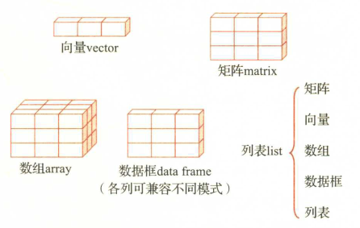

# 1.对象

R语言是一种功能强大的统计分析软件，同时R语言也是一种严谨但却相当优美灵活的语言，特别地，R语言是一种基于对象（objects）的语言。

什么是对象？对象就是物体。根据"R语言简介"文档，R语言所创建和操作的物体被称为对象。对象可以是变量（variables）、数组（arrays of numbers）、字符串（character strings）、函数（functions），或者是由这些要素组成的其他结构。

了解R语言中的对象显得十分重要。这主要表现在以下两个方面。

第一，在R语言中，数据与数据分析的结果（通常包含一系列过程）都存放在对象中。尽管对象中的内容非常丰富，但是R语言仅返回一个最小化的输出结果。这样的设计具有实用性，如果你仅仅关心对象中包含的若干信息，就只需要在稍后调用相关函数进行查阅即可，而不需要将所有结果都显示在屏幕上。这样既节省空间，又富有工作效率。换句话说，对象中包含了我们所关心的数据和其他信息。

第二，由于R语言中所有的东西都是对象，那么，如果不给予这些对象有效的管理，将会出现杂乱无章的情况。俗语说：“物以类聚，人以群分。”而物和人的分类都是基于某些共通的特征。在R语言中，对象就是“物”，与自然界中的物体一样，不同的对象具有不同的特征，我们可以根据这些特征将对象归类。换句话说，归属到某一类（class）的对象至少在某个特征上是共通的。

# 2.属性、类和模式

有了上面这些基本的认识，我们可以进一步地探讨对象。由于对象中可以包含很多信息，因此，要了解对象，首先要看对象的属性（attributes）。在R语言中，任何对象都具有多个描述其内在信息的属性，其中最重要的两个属性是类和模式。

假设我们的目的是利用R语言做统计分析，前面有一组数据，而为了分析这些数据，我们必须为其在R语言中选择适当的方式—某种数据结构（data structure）来存储这些数据向量（vector）是R语言中存储和管理数据的最基本单位。其他的数据结构都是在向量的基础上诞生的，因此向量也被称为原子向量（atomic vector）。在此先构建一个名为x1的向量，其中的元素都是数字。具体如代码2-1所示。

<!--代码2-1-->

```R
x1<-c(1,2,3)
attributes(x1)
NULL
class(x1)
[1] "numeric"
mode(x1)
[1] "numeric"
```

使用 attributes()函数查看向量x1的属性，返回的结果为NULL，即空数据（或空值）。由于向量是R语言中内置的最基本的类，关于它的信息基本上是一目了然的，所以也就没有什么用于显示了。

使用class()函数查看向量x1的类，返回结果为numeric，即x1是数值型的向量。使用mode()函数查看R语言中的各种对象被存储的类型，返回值为numeric，即数据被处理为数值型。在这个例子中，class()函数和mode()函数返回的结果相同，这两个函数的区别在哪里呢？我们稍后就会看到其中的差别。

接着我们以向量x1为基础构造一个矩阵，如代码2-2所示。

<!--代码2-2-->

```R
m<-cbind(x1,x2=x1)
m
     x1 x2
[1,]  1  1
[2,]  2  2
[3,]  3  3
attributes(m)
$dim
[1] 3 2

$dimnames
$dimnames[[1]]
NULL

$dimnames[[2]]
[1] "x1" "x2"
```

使用attributes()函数查看矩阵m的属性，返回的结果告诉我们矩阵m的一些基本属性：这是一个3行2列矩阵；矩阵有列的名称，即x1和x2，但没有行的名称。

使用class()函数查看对象m的类，返回的结果告诉我们，对象m的类是矩阵。使用mode()函数查看对象m的存储类型，结果显示为数据被存储为数值型。在此class()函数和mode()函数的功能就容易理解了。

上面所举的例子非常简单，例如读者会问，我明明知道m是一个矩阵，那么再去查看的类有什么意义呢？为了回答这个问题，我们再来看一个例子。

R语言作为统计软件，可以很方便地进行回归分析。R语言自带了很多测试数据集，其中一个是cars，它包含两个变量，speed是车速，dist是制动距离。我们可以建立一个回归方程，其中的被解释变量是dist，解释变量是 speed，使用函数lm()就可以估计回归方程。在R语言中，回归模型也是对象。我们把回归的结果赋值给变量reg，如代码2-3所示。

<!--代码2-3-->

```R
reg<-lm(dist~speed,data=cars)
attributes(reg)
$names
 [1] "coefficients"  "residuals"     "effects"       "rank"         
 [5] "fitted.values" "assign"        "qr"            "df.residual"  
 [9] "xlevels"       "call"          "terms"         "model"        

$class
[1] "lm"
class(reg)
[1] "lm"
mode(reg)
[1] "list"
```

按照此前的操作步骤，首先查看对象reg的属性，可以看到，对象reg中包含了大量信息，如回归系数、残差等。同时，属性中也显示，对象reg的类是lm，即线性回归模型。class()函数的返回结果确认了这一事实。mode()函数返回的结果显示，对象reg的存储模式是列表(list)。

在这个例子中，请设想一下，你拿到了一组复杂的代码，而且一时间不知道对象reg的构造过程，而只知道这是某个变量，那么通过以上函数，我们就能够快速地了解对象reg的信息。

识别对象的类的一个重要作用，在于在使用很多函数的时候，可以自动地调用最适合处理这种类的函数。举例来说，我们知道reg的类是lm，当使用作图函数plot()时，使用命令plot(reg)，它就会自动调用函数plot.lm()来进行处理，而不需要手动输入plot.lm(reg)命令。中国的成语“触类旁通”，用在这里是最合适不过的。

最后，可以使用函数methods()来查看有哪些函数能够处理某种特定的类，如这里的lm。可以键入methods(class=matrix)、 methods(class=lm)等命令来查看。

# 3.数据结构

向量、矩阵、数组、数据框和列表是R语言中的基本数据结构。

数据框是最常使用的一种数据结构。



## 3.1.向量

向量和矩阵是R语言中最基本的数据结构。向量（行向量和列向量）的概念是易于理解的。简单的数据，或者说标量，是特殊的向量（长度为1的向量）。因此，向量是R语言中最基本的数据结构。向量必须由类型相同的元素构成。

使用赋值符号"<-"和组合函数c()，就可以创建各种类型的向量。下面的例子具有代表性（见代码2-4）：

<!--代码2-4-->

```R
numeric<-c(1,-1,0.5,-0.5)
character<-c("one hundred","two thousand","three million")
logical<-c(TRUE,FALSE,TRUE,FALSE)
```

在控制台上依次键入以上代码，然后再分别输入numeric、character和logical，屏幕上就会显示（见代码2-5）

<!--代码2-5-->

```R
numeric
[1]  1.0 -1.0  0.5 -0.5
character
[1] "one hundred"   "two thousand"  "three million"
logical
[1]  TRUE FALSE  TRUE FALSE
```

可以看到，变量numeric返回的是一个数值型的向量，变量character返回的是字符型的向量，变量logical返回的是逻辑型的向量。需要注意的是，在同一向量中，无法组合不同模式的数据。换句话说，R语言只接受具有同一模式数据的向量。如果你这样做（见代码2-6）

<!--代码2-6-->

```R
x<-c(1,"one hundred",TRUE)
x
[1] "1" "one hundred" "TRUE"
mode(x)
[1] "character"
```

所返回的结果是，向量x被处理为字符型的向量。或者，如果你这样做（见代码2-7）

<!--代码2-7-->

```R
y<-c(1,TRUE,FALSE)
y
[1] 1 1 0
mode(y)
[1] "numeric"
```

所返回的结果说明y被处理为数值型的向量。此处，mode()函数返回了你所关心的对象的存储模式。

在R语言中，有6种基本的向量类型或模式，它们分别是：逻辑型（logical）、整数型（integer）、实数型（double）、复数型（complex）、字符型（string或character）以及字节型（raw）。

使用typeof()、mode()和storage.mode()函数可以查看向量的类型，但是其返回值略有差异，在不同函数中，对应的关系如表2-1所示。

| 类型   | typeof    | mode      | storage.mode |
| ------ | --------- | --------- | ------------ |
| 逻辑型 | logical   | logical   | logical      |
| 整数型 | integer   | numeric   | integer      |
| 实数型 | double    | numeric   | double       |
| 复数型 | complex   | complex   | complex      |
| 字符型 | character | character | character    |
| 字节型 | raw       | raw       | raw          |

只含有一个元素的向量是标量，它是长度为1的特殊向量。例如（见代码2-8）：

<!--代码2-8-->

```R
scalar<-"This is a scalar"
scalar
[1] "This is a scalar"
length(scalar)
[1] 1
```

作为比较，下面的这个向量vector的长度为4。函数length()返回的是向量的长度（见代码2-9）

<!--代码2-9-->

```R
vector<-c("This","is","a","scalar")
vector
[1] "This" "is" "a" "scalar"
length(vector)
[1] 4
```

向量是R语言中的一种对象，我们结合向量来对属性加以解释。一旦你对属性有了初步的了解，就很容易将其推广使用

在对象的属性中，诸如类、名称（names）、维度（dimensions）等是非常重要且有用的信息。请看下面的例子（见代码2-10）

<!--代码2-10-->

```R
score<-c(90,77,82,85)
score
[1] 90 77 82 85
```

向量score包含了4个学生的测试成绩。利用属性函数attributes()，观察 score的属性，结果显示为空。得到这个结果并不奇怪，因为此时向量 score非常简单，仅包括4个元素（4个数值），其信息一目了然。

我们可以为向量添加其他信息，例如，借助函数names()来给向量的元素命名，按照A、B、C、D来给学生的成绩划分等级。然后，再观察 score的属性。可以看到，向量score的每一个元素都具有了名称（见代码2-11）。

<!--代码2-11-->

```R
names(score)<-c("A","C","B","B")
score
 A  C  B  B 
90 77 82 85
attributes(score)
$names
[1] "A" "C" "B" "B"
```

获得了对象的相关属性后，还可以利用这些属性对对象进行"改造"。例如，对于向量score，可以按成绩高低重新排列各个元素（见代码2-12）。

<!--代码2-12-->

```R
score[c("A","B","B","C")]
 A  B  B  C 
90 82 82 77 
```

在实际操作中，经常使用属性函数attributes()可以让我们掌握R语言中对象的各种信息。这对下面要分析的矩阵、数组、数据框、列表等数据结构尤其有用。

## 3.2.矩阵

矩阵是用行（row）和列（column）对元素进行定位的二维数据结构。在R语言中生成个矩阵十分方便，使用帮助命令help（matrix）从R语言中获取其基本用法为：

```R
matrix(data=NA,nrow=1,ncol=1,byrow=FALSE,dimnames=NULL)
```

其中，dimnames是指矩阵维度的名称，这在下面关于数组的讨论中进一步展开。此处需要主要注意的是，与向量一样，矩阵中所有元素必须为同一种数据类型。

<!--代码2.13-->

```R
x<-matrix(c(1:12),nrow=3,ncol=4,byrow=TRUE)
x
     [,1] [,2] [,3] [,4]
[1,]    1    2    3    4
[2,]    5    6    7    8
[3,]    9   10   11   12
```

在变量x中，c(1:12)创建了一个向量，参数nrow和ncol分别设定我们所要创建的矩阵的行数和列数，byrow则告诉R语言是否按照行来将数据填充进入矩阵。在矩阵x生成后，方括号中的数字[i,j]显示了元素的位置，i代表第i行，j代表第j列。例如，元素10在矩阵第3行[3,]，第2列[,2]的位置上。

这种标记元素位置的方法非常有用处，可以很方便地对矩阵的元素进行选取（获取矩阵的子集）或者对数据进行访问。沿用上面的矩阵x，下面是几个例子。

（1）选取矩阵的某一个元素，如矩阵x的第2行第4列的元素（见代码2-14）

<!--代码2-14-->

```R
x[2,4]
[1] 8
```

（2）选取矩阵的某一行所有列的元素，如矩阵x的第2行所有列的元素（见代码2-15）

<!--代码2-15-->

```R
x[2,]
[1] 5 6 7 8
```

（3）选取矩阵的多行多列的元素，如矩阵x的第2行第2、4列，第3行第2、4列的元素（见代码2-16）

<!--代码2-16-->

```R
x[c(2,3),c(2,4)]
     [,1] [,2]
[1,]    6    8
[2,]   10   12
```

（4）剔除矩阵的某行和（或）某列，保留剩下的元素，如剔除矩阵x的第1行x[-1,]，或者剔除矩阵的第1 行，同时剔除矩阵的第3列的元素（见代码2-17）

<!--代码2-17-->

```R
x[-1,]
     [,1] [,2] [,3] [,4]
[1,]    5    6    7    8
[2,]    9   10   11   12
x[-1,-3]
     [,1] [,2] [,3]
[1,]    5    6    8
[2,]    9   10   12
```

这种对矩阵元素选取或剔除的方法实际上也适用于向量，因为向量无非是矩阵的特例而已。这也就意味着，我们可以用向量来生成矩阵。不妨令（见代码2-18）

<!--代码2-18-->

```R
x<-c(1:4)
y<-c(5:8)
z<-c(9:12)
```

利用is.vector()和is.matrix()函数，对x是否为向量或矩阵做出判断（尽管在这个例子中是显而易见的），如代码2-19所示。

<!--代码2-19-->

```R
is.vector(x)
[1] TRUE
is.matrix(x)
[1] FALSE
```

为了将向量x，y，z组合成一个新的矩阵，需要用到结合函数cbind()或rbind()，前者是将所需要的变量以列的方式组合，后者是以行的方式组合。先以行的方式进行组合，结果显示，新的变量xyz是一个矩阵，如代码2-20所示。

<!--代码2-20-->

```R
xyz<-rbind(x,y,z)
xyz
  [,1] [,2] [,3] [,4]
x    1    2    3    4
y    5    6    7    8
z    9   10   11   12
is.matrix(xyz)
[1] TRUE
```

再以列的方式进行组合，新的变量zyx也是一个矩阵，如代码2-21所示。

<!--代码2-21-->

```R
zyx<-cbind(x,y,z)
zyx
     x y  z
[1,] 1 5  9
[2,] 2 6 10
[3,] 3 7 11
[4,] 4 8 12
is.matrix(zyx)
[1] TRUE
```

事实上，矩阵zyx无非是矩阵xyz的转置，转置函数为t()，如代码2-22所示。

<!--代码2-22-->

```R
identical(xyz,t(zyx))
[1] TRUE
```

在矩阵xyz中，每一行都有各自的名称，但是各列没有名称，如代码2-23所示

<!--代码2-23-->

```R
rownames(xyz)
[1] "x" "y" "z"
colnames(xyz)
NULL
```

我们也可以通过rownames()和colnames()来对行、列进行命名或重命名。我们需要为矩阵xyz添加每一列的名称，如代码2-24所示。

<!--代码2-24-->

```R
colnames(xyz)<-c(LETTERS[1:4])
xyz
  A  B  C  D
x 1  2  3  4
y 5  6  7  8
z 9 10 11 12
```

对于有行列名称的矩阵，还可以用名称来选取相应的元素或子集，例如代码2-25所示：

<!--代码2-25-->

```R
xyz["y","B"]
[1] 6
```

## 3,3数组

如果说矩阵是向量的推广，那么数组就是矩阵的推广。数组和矩阵作为数据结构的一个主要特征是具有维度（缩写为dim）。因此，数组和矩阵是添加了维度属性的向量。维度属性在数组的基本用法中被明确体现出来。使用命令help(array)查看数组的基本用法

```R
array(data=NA,dim=length(data),dimnames=NULL)
```

其中，data是指数组中的数据。对维度的理解，可以先从矩阵开始。给定任意一个矩阵，比如这里的变量mat，如代码2-26所示。

<!--代码2-26-->

```R
mat<-matrix(c(1:6),2,3,byrow=TRUE)
mat
     [,1] [,2] [,3]
[1,]    1    2    3
[2,]    4    5    6
```

对于mat中的任意一个元素，比如3，我们知道它位于第1行第3列，基于此，我们还可以用下标来表示3的位置，比如说$3_{1,3}$，而维度正是等于下标的个数。在R语言中，dim()函数返回各个维度的最大值，如代码2-27所示：

<!--代码2-27-->

```R
dim(mat)
[1] 2 3
```

dim()函数告诉我们，矩阵mat的维度是2，因为其返回了两个数值。同时，矩阵mat是一个2行3列矩阵，或者写成$\operatorname{mat}_{2 \times 3}$。

由于矩阵是向量的推广，因此，可以将矩阵看成是赋予维度的向量。这在下面这个例子中得到充分说明（见代码2-28）

<!--代码2-28-->

```R
x<-c(1:10)
dim(x)<-c(2,5)
x
     [,1] [,2] [,3] [,4] [,5]
[1,]    1    3    5    7    9
[2,]    2    4    6    8   10
is.matrix(x)
[1] TRUE
attributes(x)
$dim
[1] 2 5
```

类似的构造方法可应用于将向量转变为数组。对于数组而言，它可以看成是由多个矩阵构成的数据结构。先构造一个3维数组ray1，如代码2-29所示。

<!--代码2-29-->

```R
ray1<-array(c(1:30),dim=c(5,3,2))
ray1
, , 1

     [,1] [,2] [,3]
[1,]    1    6   11
[2,]    2    7   12
[3,]    3    8   13
[4,]    4    9   14
[5,]    5   10   15

, , 2

     [,1] [,2] [,3]
[1,]   16   21   26
[2,]   17   22   27
[3,]   18   23   28
[4,]   19   24   29
[5,]   20   25   30
dim(ray1)
[1] 5 3 2
```

从中可以看出，数组ray1是由一个长度为30的向量转变而来的，参数dim=c(5,3,2)意味着，它由两个矩阵组成，每个矩阵都是5行3列，因此，这是一个5×3×2的数组。

在数组的基本用法代码中，对参数dim=length(data)的理解如代码2-30所示。

<!--代码2-30-->

```R
length(c(1:30))
[1] 30
5*3*2
[1] 30
```

在上面这个例子中，如果将数组中数据部分的向量设定为c(1:20)，同时保持数组的维度不变，则R语言会应用循环原则将数据补齐，请参考如代码2-31所示的例子。

<!--代码2-31-->

